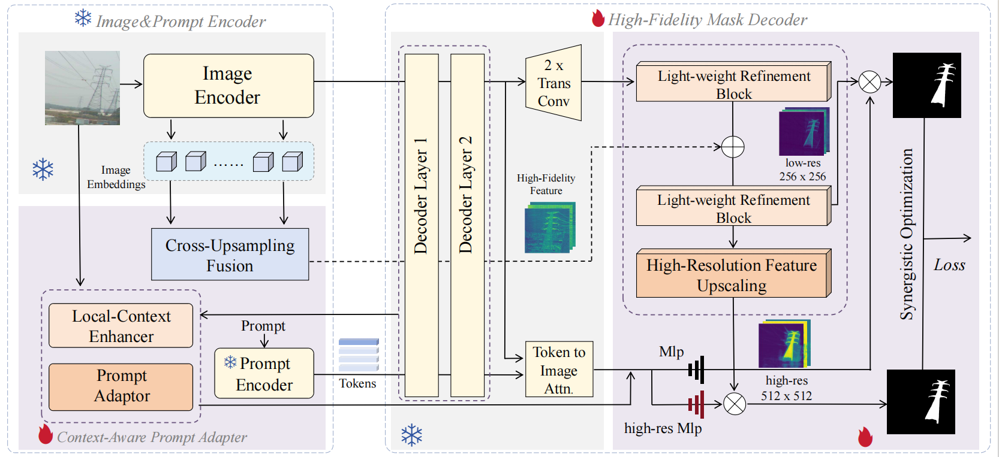
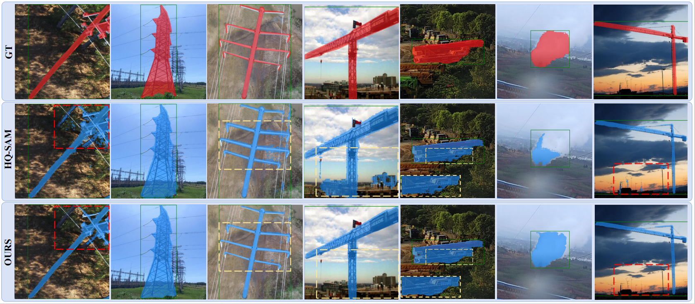
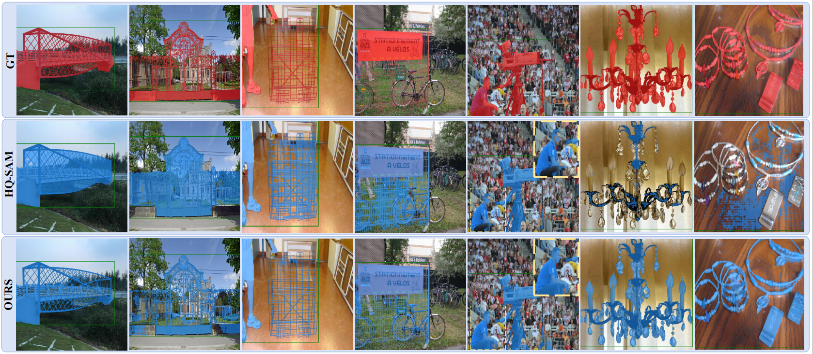

# **Adapting Segment Anything Model for Power Transmission Corridor Hazard Segmentation**

This software implements Adapting Segment Anything Model for Power Transmission Corridor Hazard Segmentation in PyTorch. For more details, please refer to our paper. 

## Abstract

Power transmission corridor hazard segmentation (PTCHS) aims to separate transmission equipment and surrounding hazards from complex background, conveying great significance to maintaining electric power transmission safety. Recently, the Segment Anything Model (SAM) has emerged as a foundational vision model and pushed the boundaries of segmentation tasks. However, SAM struggles to deal with the target objects in complex transmission corridor scenario, especially those with fine structure. In this paper, we propose ELE-SAM, adapting SAM for the PTCHS task. Technically, we develop a Context-Aware Prompt Adapter to achieve better prompt tokens via incorporating global-local features and focusing more on key regions. Subsequently, to tackle the hazard objects with fine structure in complex background, we design a High-Fidelity Mask Decoder by leveraging multi-granularity mask features and then scaling them to a higher resolution. Moreover, to train ELE-SAM and advance this field, we construct the ELE-40K benchmark, the first large-scale and real-world dataset for PTCHS including 44,094 image-mask pairs. Experimental results for ELE-40K demonstrate the superior performance that ELE-SAM outperforms the baseline model with the average 16.85% mIoU and 20.61% mBIoU performance improvement. Moreover, compared with the state-of-the-art method on HQSeg-44K, the average 2.9% mIoU and 3.8% mBIoU absolute improvements further validate the effectiveness of our method on high-quality generic object segmentation.



## Installation

- The conda environment for the code can be created using the `ele-sam.yaml` file provided with the scripts:

  ```shell
  ```bash
  > conda env create --f ele-sam.yml
  > conda activate ele-sam
  ```

## Dataset

- [ELE-40K Dataset](https://pan.baidu.com/s/1-0v0G2HpX0K5-uKjTjLLQQ) (39mv)
- [HQSeg-44K Dataset](https://huggingface.co/sam-hq-team/sam-hq-training/tree/main/data) 

- Dataset structure

  ```
  data
  -ELE-40K
  |____Equipment
  | |____train
  | |____val
  |____Hazard
  | |____train
  | |____val
  
  -HQSeg-44K
  |____DIS5K
  |____cascade_psp
  | |____DUTS-TE
  | |____DUTS-TR
  | |____ecssd
  | |____fss_all
  | |____MSRA_10K
  |____thin_object_detection
  | |____COIFT
  | |____HRSOD
  | |____ThinObject5K
  
  pretrained_checkpoint
  |____sam_vit_l_0b3195.pth
  |____sam_vit_l_maskdecoder.pth
  ```

## Train

    python -m torch.distributed.launch --nproc_per_node=2 train.py --checkpoint ./pretrained_checkpoint/sam_hq_vit_l.pth --model-type vit_l --output ./DIR/

## Evaluate model performance

    python -m torch.distributed.launch --nproc_per_node=2 train.py --checkpoint ./pretrained_checkpoint/sam_hq_vit_l.pth --model-type vit_l --output ./DIR/ --eval --restore-model <path/to/training_checkpoint>

## Visualization

    python -m torch.distributed.launch --nproc_per_node=2 train.py --checkpoint <path/to/checkpoint> --model-type <model_type> --output <path/to/output> --eval --visualization --restore-model <path/to/training_checkpoint>

## Pre-trained models

The pre-trained models in ELE-40K dataset are available. 

[baidu disk](https://pan.baidu.com/s/1NCKNnxIBnXXeGZ-bwceRTg) (bfis)

## Results

>  Here gives some examples of segmentation results, comparing with existing methods on ELE-40K Dataset in Figure (a), and Figure(b) is the results on HQSeg-44K Dataset.  

|           (a)           |
| :---------------------: |
|  |
| **(b)** |
|  |

Evaluation of ELE-SAM on ELE-40K dataset and HQSeg-44K dataset with others models:

                                                                 							**Tabel 1. Result on ELE-40K Dataset** 


​                                                          **Tabel 2. Result on HQSeg-44K Dataset** 

## Acknowledgements

The authors would like to thank the developers of PyTorch, SAM, HQ-SAM, and PA-SAM. 
Please feel free to contact us if you encounter any issues. 
